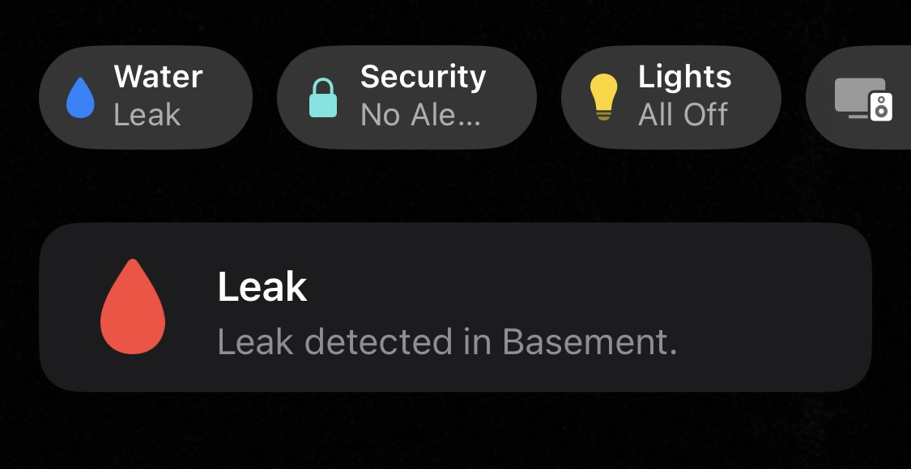
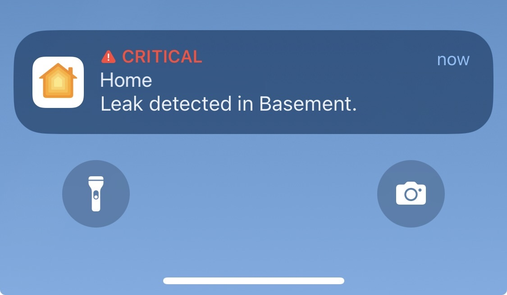

<p align="center">


</p>

<span align="center">

# Homebridge HTTP Leak Sensor

</span>

## Description

This [homebridge](https://github.com/homebridge/homebridge) plugin exposes a web-based Leak Sensor to Apple's [HomeKit](http://www.apple.com/ios/home/). Using simple HTTP requests, the plugin allows you to monitor the status of leak sensors.

Leak sensors enabled with this plugin will appear in Homekit as sensors. You will be able to check whether or not they detect a leak. When a leak is detected Homekit will send you CRITICAL alert notifications. 





## Installation

1. Install [homebridge](https://github.com/homebridge/homebridge#installation)
2. Install this plugin. `npm install -g homebridge-http-leak-sensor`.
3. Configure the accessory in `config.json`.

## Configuration

```json
"accessories": [
    {
        "accessory": "HomebridgeHTTPLeakSensor",
        "name": "Leak Sensor",
        "url": "http://192.168.1.54/status",
        "pollInterval": 60,
        "failedRequestsLimit": 100,
        "manufacturer": "Homebridge",
        "model": "Leak Sensor",
        "serialNumber": "ESP-32"
    }
]
```

### Required
| Key | Description | Default |
| --- | --- | --- |
| `accessory` | Must be `"HomebridgeHTTPLeakSensor"` |   |
| `name` | Name to appear in the Home app |   |
| `url` | URL route to your device |   |

### Optional
| Key | Description | Default |
| --- | --- | --- |
| `pollInterval` | Time (in seconds) to check device status. | `60` |
| `failedRequestsLimit` | Limit of failed requests that can be made to url before the plugin stops making requests. Value of `0` allows unlimited failed requests. | `120` |
| `model` | Appears under the _Model_ field for the accessory | `"Leak Sensor"` |
| `serial` | Appears under the _Serial_ field for the accessory | `"000000"` |
| `manufacturer` | Appears under the _Manufacturer_ field for the accessory | `"Homebridge"` |

## Device API

Your Leak Sensor API should be able to return JSON information when it receives `/status`:
```
{
    "currentState": "WET"
}
```

| State | Description |
| ----- | --- |
| `"WET"` | Device _is_ detecting a leak. |
| `"DRY"` | Device _is not_ detecting a leak. |

## Sensors

This plugin is intended to communicate with very simple DIY leak sensors. To build your own Leak Sensor see sample code in the [/examples](/examples) folder.

